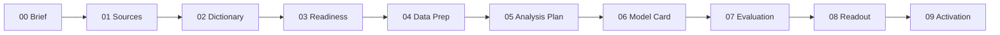

# 00 - Project Brief
*Step 00 of 09 | CRISP-DM Phase 1: Business Understanding | Audience: sponsor and analytics lead.*

This file defines the decision before any data work begins. The current project
is a work-in-progress synthetic case study inside Caio's broader MMM project
framework.

## Decision

How should next year's fixed media budget be split across linear TV, CTV,
YouTube, Meta social, branded search, and Amazon retail media?

The output needs to say which channels should get more, which should be held
flat, and which should be cut.

## Decision-Maker

The primary reader is a Head of Media or marketing analytics lead at a consumer
brand, briefing a CMO who approves the budget.

## Objective

Estimate how much revenue each paid media channel drives, identify where each
channel sits on its diminishing-returns curve, and recommend an executable
budget reallocation without increasing total spend.

The broader objective is to establish a repeatable MMM workflow that can later
extend to real advertiser data, richer controls, experiment calibration,
additional models, report-to-action automation, and MCP/tool-connected
workflows.

## Success Criteria

1. Report channel contribution and ROI as ranges, not single-number claims.
2. Distinguish average ROI from marginal ROI, because budget decisions are made
   on the next dollar, not on historical averages.
3. Show where each channel appears over-funded, under-funded, or unresolved.
4. Recommend only actions that respect real planning constraints.
5. State what would change the recommendation.

## Constraints

- Total budget is fixed. This is a reallocation question, not a request for more
  money.
- The optimizer must respect execution limits: linear TV can move less than
  digital channels because upfront commitments lock budget earlier.
- Open-source tooling only.
- The project must be explicit about uncertainty. A confident wrong answer is
  worse than no reallocation.

## Deliverables

The project uses a 10-file artifact chain:

## Out of Scope

Attribution comparison, production deployment, real experiment calibration, and
method benchmarking are outside this version. The project ends with the
experiment that should be run before moving money.

Planned future additions are real data and advertiser use cases, more control
features, experiment integration, additional model families, automated reporting
digests, and MCP/tool integration.

## Next

Continue to `01-data-sources.md`.
