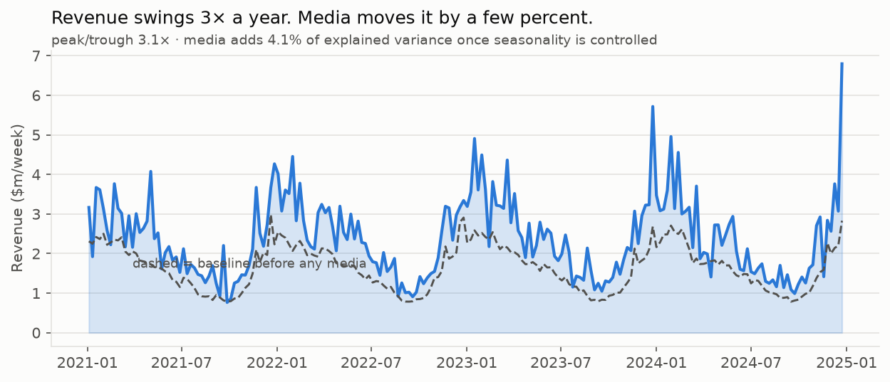
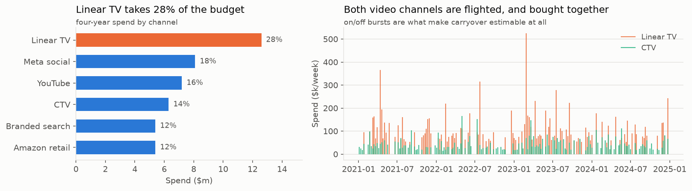
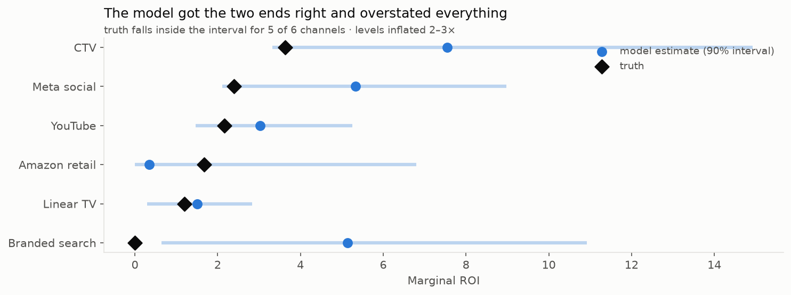
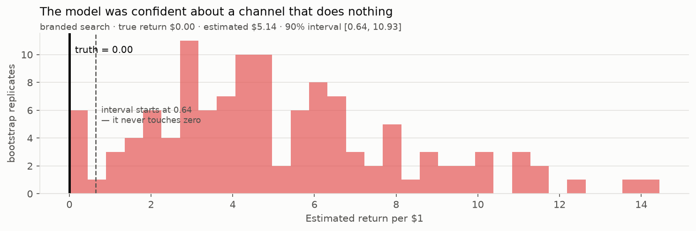

# 08 - Readout
*Step 08 of 09 | CRISP-DM Phase 6: Deployment | Audience: budget owner.*

This readout is written to be read without a presenter. It gives enough business
and process context to understand the recommendation; deeper method detail lives
in `06-model-card.md`, and the action sequence lives in `09-recommendations.md`.

Status: work in progress. This is the synthetic case-study version of Caio's MMM
project framework.

## Executive Summary

| Question | Answer |
|---|---|
| What did the model find? | Reduce linear TV and test CTV as the likely funding destination |
| Are we recommending a budget move now? | Not yet |
| Why not? | The model did not pass a control test: it credited branded search with return even though branded search was built to have no effect |
| What should happen first? | Run a six-week branded-search geo holdout |
| Cost of first test | About $62,000 of spend at risk against a $1.35m annual budget line |

This is a synthetic business case. The point is not to claim these are real
advertiser results. The point is to show how the framework checks a budget
recommendation before someone is asked to act on it.

---

## 1. Business Context

The business problem is harder than a normal channel ROI table makes it look.
Revenue is strongly seasonal, media is a small part of the movement, and the
biggest budget line is also the channel most likely to look good historically.

### Revenue Is Mostly Seasonal

Revenue swings about 3x across the year. After controlling for that seasonality,
all six paid channels together explain 4.1% of the remaining movement.

Implication: the model is working with a real but small media signal. Wide
intervals are expected, and a single confident ROI number would be misleading.

### The Budget Question Is TV vs. Streaming

Linear TV takes 28% of spend, about twice any one digital channel. TV and CTV are
also bought in bursts and often move together.

Implication: the high-value decision is whether dollars should move from
traditional TV to streaming. The data gives the model variation to learn from,
but the two channels are not perfectly separable.

---

## 2. Process Context

The project was designed to test the full decision process, not just to fit a
model. That means the source data, validation setup, and control checks matter
as much as the final ROI estimates.

### Why the Data Is Synthetic

No public real-world MMM dataset had all four things needed for this exercise:
named channels, spend, revenue, timing, and a known answer key. The answer key is
what lets us ask whether the model recovered truth rather than merely produced a
plausible story.

One channel, branded search, was deliberately given zero true effect. It acts as
a control test: a model that finds a confident return there is assigning credit
to demand that would have happened anyway.

### Source Totals Reconcile

The six source systems do not report data the same way. Google reports cost in
millionths of a dollar. Meta sends daily rows and percentage rates. Amazon omits
days when nothing happened. Linear TV arrives as agency spreadsheets.

All six channels reconcile to the dollar. That is the minimum bar. A budget
recommendation built on spend that does not tie back is not decision-ready.

---

## 3. Model Result

The model result turns on one distinction: average ROI versus marginal ROI.
Average ROI describes what a channel has returned historically. Marginal ROI
estimates what the next dollar is expected to return.

### Linear TV Looks Best Historically, But Not at the Margin

Linear TV has the highest average ROI and the lowest non-zero marginal ROI.

In plain terms: TV has worked historically, but the next dollar in TV does not
work very hard. CTV is the opposite. Its next dollar looks stronger than its
historical average, which is the pattern of an under-funded channel.

Implication: if we trusted only the model's directional ranking, the next move
would be to test moving money from linear TV toward CTV.

---

## 4. Validation

The model's recommendation is plausible, but validation decides whether it is
actionable. Because the data has known truth, the estimates can be checked
against the answer key.

### The Model Got Direction, Not Levels

The model got the most important ordering right: CTV is high, and linear TV is
low. But ROI levels were overstated by roughly 2-3x.

Why the miss happens: once seasonality is removed, media is only a few percent of
the remaining revenue movement. At that signal level, small attribution mistakes
turn into large ROI mistakes.

### The Control Test Did Not Pass

Branded search was built to have exactly zero true effect. The model reported
$5.14 per dollar, and the interval never approached zero.

That is the key risk. Branded search is almost always on and rises when demand
rises. The model credited it for sales that were really caused by underlying
demand.

### Carryover Was Not Reliably Recovered

Advertising carryover was recovered for only two of six channels. Weekly data
often cannot cleanly separate sales caused by this week's spend from sales caused
by prior weeks' spend, especially when channels are flighted together.

Implication: the model can predict revenue while still misreading the media
mechanism. That makes it useful for prioritizing experiments, not sufficient as
the sole basis for moving budget.

---

## 5. Recommendation

Run the branded-search test first.

| Step | Action | Reason |
|---|---|---|
| 1 | Switch branded search off in 40% of matched markets for six weeks | Tests the exact risk that blocks immediate reallocation |
| 2 | Watch whether organic search clicks rise as paid clicks fall | Measures whether paid branded search is cannibalizing organic demand |
| 3 | Test CTV before scaling it | The model points to CTV, but levels are overstated |
| 4 | Test the linear TV reduction before upfront negotiations | Reversing TV commitments gets expensive later |

The first test puts about $62,000 at risk against a $1.35m annual line item.
eBay ran this kind of branded-search test in 2015 and found branded search was
close to worthless for them.

## What To Remember

- The model finds a credible direction: linear TV down, CTV tested upward.
- The model should be validated experimentally before it is used to move budget.
- Branded search is the first test because it is cheap, fast, and addresses the
  model's clearest risk.
- The next MMM should be calibrated with experiment results before it is used for
  reallocation.

## What Would Change This View

An incrementality test showing branded search drives sales. That would mean the
model was right and the synthetic setup was unrealistic. It is the one experiment
that settles the disagreement either way.
