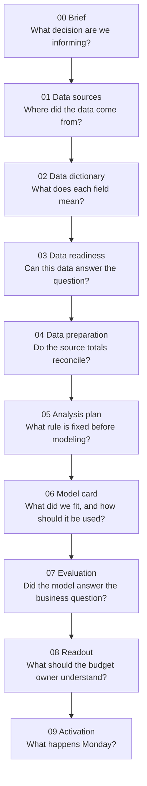

# Caio's MMM Project Framework

*Work in progress | Current version: synthetic case study*

**Decision:** whether to reallocate next year's media budget across linear TV,
CTV, YouTube, Meta, branded search, and Amazon retail media.

**Finding:** the model points in the right direction, but does not pass a control
test. Use the model to decide what to test next, not as the sole basis for
moving budget. Run a six-week branded-search holdout first: about **$62,000** at
risk to settle a **$1.35m-a-year** question.

## Reader Path

| If you have | Read | Stop when you know |
|---|---|---|
| 2 minutes | [`09-recommendations.md`](09-recommendations.md) | What to do next, cost, timing, and trigger to rebuild |
| 5 minutes | [`08-readout.md`](08-readout.md) | Why the model found a plausible answer and why we still should not act |
| 20+ minutes | `00` through `07` below | Whether the data, method, and validation are defensible |

## Process Map

## Framework Choices

This case study shows how I would structure MMM work from business question to
action, with emphasis on validation, decision rules, and operational use:

| Choice | How it shows up |
|---|---|
| Test against truth | The dataset has a known answer key, so the model can be scored directly |
| Preserve source complexity | Platform-shaped exports are ingested and reconciled before modeling |
| Check for invented lift | Branded search is included as a zero-effect control channel |
| Pre-commit the decision rule | Success and abandon criteria are set before the model is fit |
| Act with restraint | The model finds the right TV-to-CTV direction, but the recommendation remains an experiment first |

## Current Scope

This version is intentionally synthetic. It is meant to prove the workflow:
business framing, source audit, data reconciliation, pre-set decision rule, model
fit, recovery against truth, readout, and activation plan.

Future additions:

- Real data and advertiser use cases.
- More control features for demand, promotions, pricing, competition, and macro
  conditions.
- Experiment design and calibration, including geo tests and lift studies.
- Additional model families for comparison.
- Report-to-action automation: recurring readouts, curated digests, monitoring,
  and decision reminders.
- MCP/tool integration for connecting source systems, modeling outputs, and
  reporting workflows.

## Data Engineering and Design

The project is designed to make the unglamorous MMM work visible:

| Design choice | Implementation | Reason |
|---|---|---|
| Start from source reality | Create platform-shaped exports before any clean modeling table exists | Mirrors the data work that usually decides whether MMM is usable |
| Normalize platform quirks | Handle micros, percent-vs-ratio rates, daily-to-weekly rollups, zero rows, non-additive reach, report footers, and late restatement | Prevents technical reporting differences from becoming false media signals |
| Reconcile before modeling | Tie each channel back to generated source spend | Gives the model input a finance-friendly audit check |
| Keep assumptions visible | Estimate adstock and saturation in the model rather than baking them into engineered columns | Makes model assumptions reviewable |
| Design for decisions | Separate business context, process context, validation, and activation | Helps senior readers understand what to do without reading code |

## Stack

| Layer | Current stack | Scale-up stack |
|---|---|---|
| Storage | CSV and JSON | BigQuery, Snowflake, DuckDB, Postgres |
| Simulation and ingestion | Python, pandas, numpy | Platform APIs, agency drops, MCP/tool connectors |
| Transformations | Python scripts | dbt or SQLMesh |
| Orchestration | Manual script and notebook execution | Dagster, Prefect, Airflow |
| Feature engineering | Python, pandas, `holidays` | Versioned feature pipelines and data-quality checks |
| MMM models | scipy optimization and constrained least squares | Robyn, Meridian, PyMC-Marketing, custom lightweight MMM |
| Uncertainty and validation | 13-week block bootstrap, known-truth recovery | Experiment calibration, geo holdouts, lift tests, model registry |
| Review | Jupyter notebooks | Reproducible reviewer workflow and sign-off |
| Reporting | matplotlib figures, markdown readout | Dashboards, scheduled readouts, curated digests, alerts |
| Action follow-up | Manual activation memo | Report-to-action automation and MCP/tool integration |

## Artifact chain

| Step | File | Audience | Purpose |
|---|---|---|---|
| 00 | [`00-brief.md`](00-brief.md) | Sponsor | Decision, owner, success criteria, and constraints |
| 01 | [`01-data-sources.md`](01-data-sources.md) | Analytics lead | Source provenance and why simulation was required |
| 02 | [`02-data-dictionary.md`](02-data-dictionary.md) | Analyst | Current modeling-table fields and units |
| 03 | [`03-data-quality.md`](03-data-quality.md) | Analytics lead | Candidate-data audit and why the public data was rejected |
| 04 | [`04-data-prep.md`](04-data-prep.md) | Technical reviewer | Reconciliation, transformations, and feature construction |
| 05 | [`05-analysis-plan.md`](05-analysis-plan.md) | Technical reviewer | Metric, method, controls, and pre-registered decision rule |
| 06 | [`06-model-card.md`](06-model-card.md) | Technical reviewer | Specification, assumptions, validation, and use-with-care guidance |
| 07 | [`07-evaluation.md`](07-evaluation.md) | Analytics lead | Whether the model can carry the business recommendation |
| 08 | [`08-readout.md`](08-readout.md) | Budget owner | Business story readable without a presenter |
| 09 | [`09-recommendations.md`](09-recommendations.md) | Budget owner | Experiment plan, sequencing, and monitoring |

## Repository Layout

| Path | Contents |
|---|---|
| [`data/`](data/) | Raw, audit, simulated, reconciled, and model-result artifacts |
| [`notebooks/`](notebooks/) | Exploratory and results-review notebooks |
| [`outputs/readout/`](outputs/readout/) | Figures used in the readout |
| [`reference/`](reference/) | Data-generating process, platform-source notes, and industry alignment |
| [`src/`](src/) | Simulation, ingestion, feature, model, and figure-generation scripts |

## Glossary

| Term | Meaning here |
|---|---|
| Marketing mix modeling | Estimating how much revenue each media channel drove from historical spend and sales patterns |
| Average ROI | What a channel returned in total historically |
| Marginal ROI | What the next dollar in a channel is expected to return |
| Carryover | Advertising effect that continues after the spend week |
| Saturation | The point where more spend still helps, but each extra dollar helps less |
| Incrementality test | A controlled experiment that measures whether sales changed because advertising changed |
| Geo holdout | Turning a channel off in selected markets and comparing them with similar markets where it stayed on |
| Pre-registration | Writing the success and failure rules before fitting the model |
