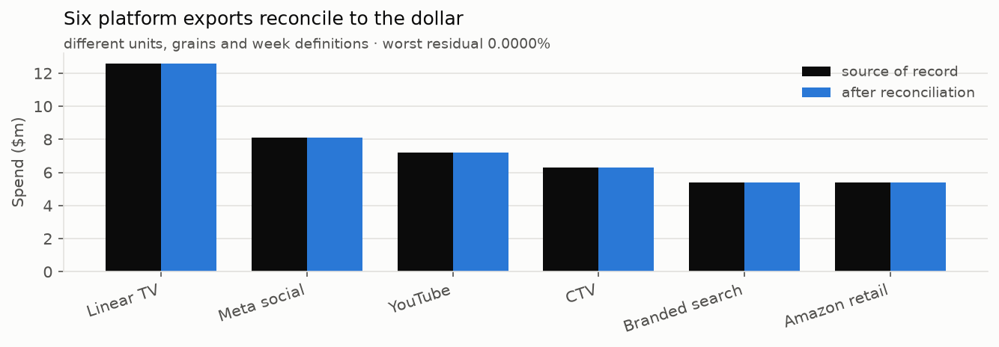
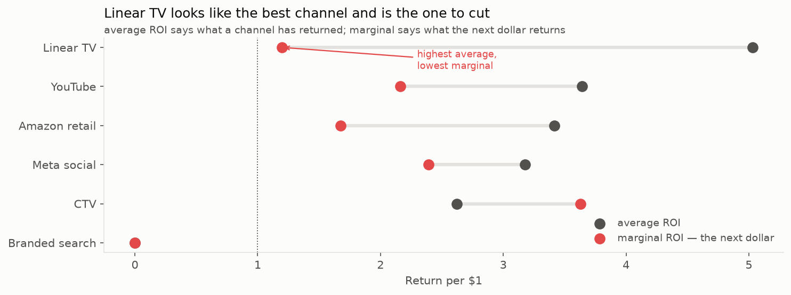
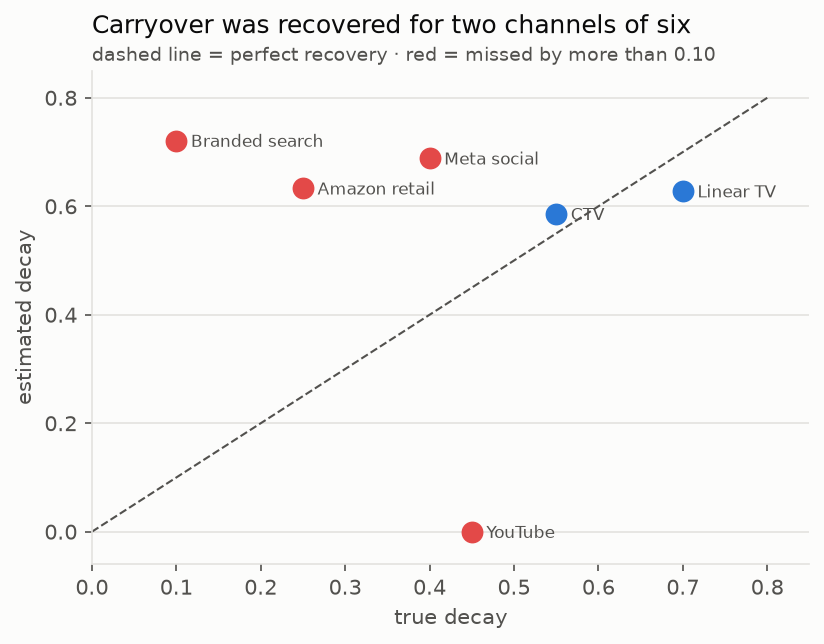
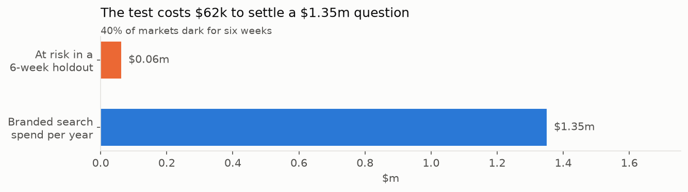

# 08 — Readout
*CRISP-DM Phase 6: Deployment. Cap: 800w.*

> Written to be **read alone**. Audience is the manager who owns the budget.
> Method detail lives in `06-model-card.md`.
>
> **STATUS:** WRITTEN · **Done when:** ✅ a reader with nobody presenting gets the whole story

## The finding

**We can identify which channel to cut and which to fund — but the model failed a
test we set before running it, so we are not asking you to move money yet. One
six-week experiment costing about $62,000 settles it.**

---

## 1. The problem is harder than it looks

**Revenue swings 3× a year, and media moves it by a few percent.** Once
seasonality is accounted for, all six channels together explain **4.1%** of what
remains. Any honest analysis of this business is an analysis of a small signal
inside a large seasonal wave — which is why the intervals below are wide, and why
anyone quoting a confident single number is overclaiming.

## 2. Where the money goes

**Linear TV takes 28% of the budget — twice any digital channel.** TV and CTV are
flighted in bursts and bought together, which matters twice over: the on/off
pattern is what makes carryover measurable at all, and their correlation is
exactly what makes separating them hard. Separating them *is* the recommendation.

## 3. The data was assembled from six systems that disagree

Google Ads reports cost in millionths of a dollar. Meta reports click-through as
a percentage where Google reports a fraction, sends daily rows with no weekly
option, and revises the last four weeks after the fact. Amazon omits any day a
campaign did not run — so a missing row means zero, not missing data. TV and
print arrive as agency spreadsheets with no API at all.

**All six reconcile to the dollar.** That is the floor, not an achievement — but
a reallocation built on a number that does not tie back is not worth reading.

---

## 4. What we found: the channel that looks best is the one to cut

**Linear TV has the highest average return of any channel and the lowest return
on the next dollar.** It is past the point where more money buys more response.
CTV is the mirror image — the only channel whose *next* dollar earns more than
its average, meaning it is under-funded.

Average return tells you what a channel has already delivered. Marginal return
tells you what the next dollar does. **Budgets are set at the margin**, and an
analyst optimising on average return would fund linear TV further.

## 5. What the model recovered

Because this dataset was built with known answers, every estimate can be scored.
**The model ranked the two ends correctly — CTV highest, linear TV among the
lowest — and overstated every level by two to three times.**

For a reallocation, the order matters more than the level. That is the case for
acting on it. What follows is the case against.

---

## 6. Why we are not acting on it

We included a channel — branded search — built to have **exactly no effect**. It
is the control on the experiment: a model that reports a return here is
manufacturing one.

**It reported $5.14 per dollar, and it was confident.** Across 120 resamples the
estimate never approached zero.

This matters beyond one channel. A model that invents a return where none exists
cannot be trusted on the returns it reports elsewhere — including the ones it got
right. **And nothing in the output identifies branded search as the suspect one.**
Its estimate looks exactly as credible as CTV's. Without a planted answer we would
have shipped it.

The corroborating evidence: **advertising's carry-over was recovered for two
channels of six.** The model predicts revenue well while getting most of the
underlying mechanics wrong — which is precisely how a marketing model fails
without looking like it has.

---

## 7. What to do instead

**Switch branded search off in 40% of markets for six weeks and measure the
difference.** About **$62,000 of spend at risk** against a **$1.35m-a-year** line
item. Six weeks to an answer.

Watch whether organic search clicks rise as paid falls — that is the whole
question in one number. **eBay ran this exact test in 2015 and found their branded
search advertising was close to worthless.**

Then test CTV before funding it, and linear TV at the ±20% that upfront
commitments allow — before next year's negotiations, when reversing gets
expensive.

Full sequence and timings in `09-recommendations.md`.

---

## What would change our mind

An incrementality test showing branded search does drive sales. That would mean
the model was right and our test data was unrealistic — and it is the one
experiment that settles it either way.
